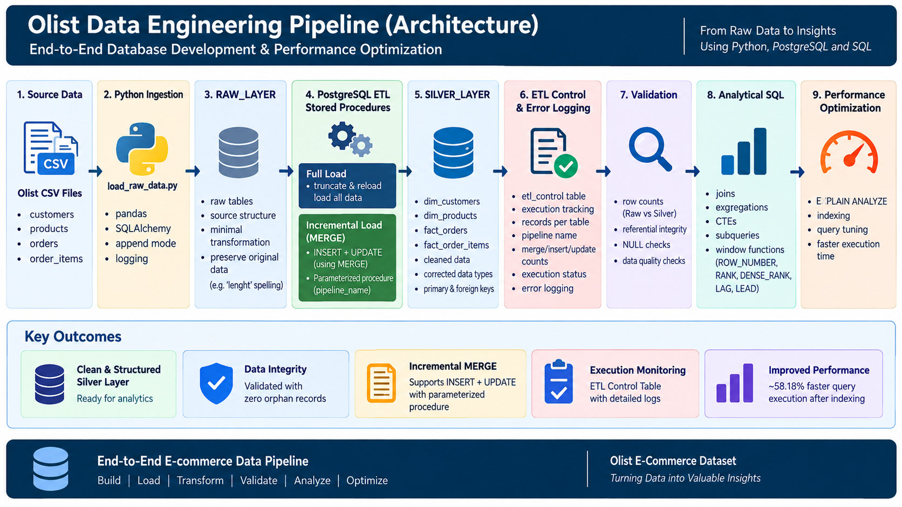
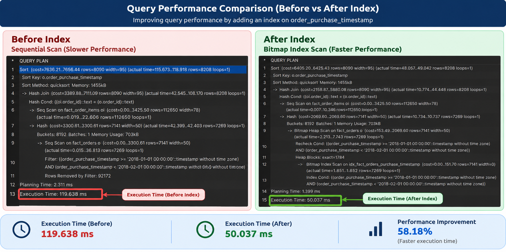
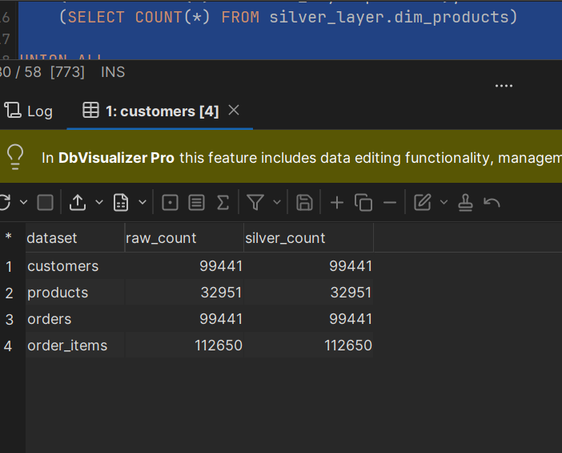
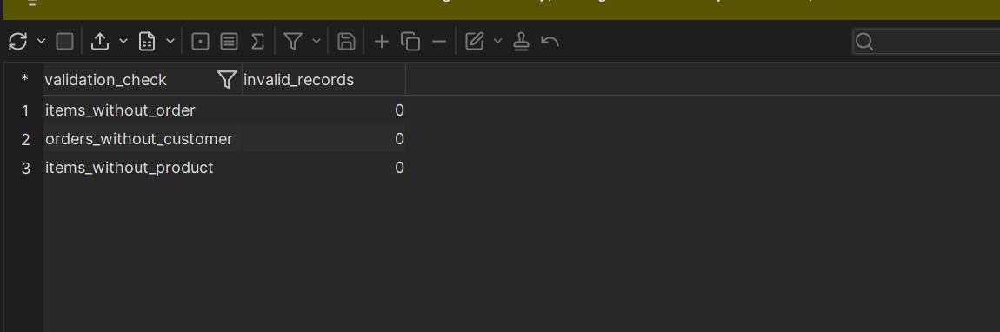
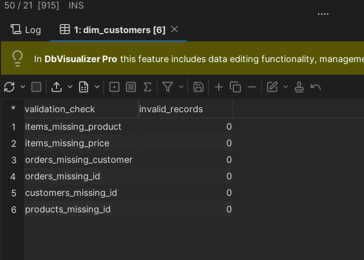
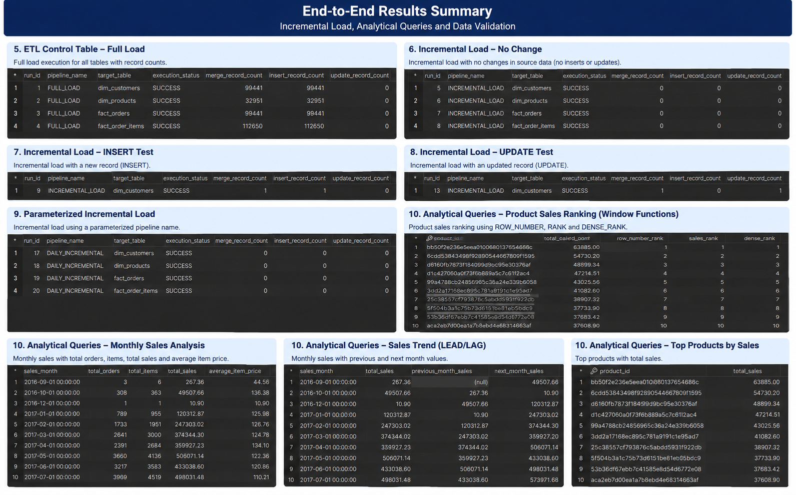

# End-to-End Database Development & Performance Optimization


## Project Architecture & Data Flow

The following diagram provides an overview of the complete end-to-end data engineering pipeline implemented in this project.



## Olist E-Commerce Data Engineering Project

This project implements a complete end-to-end database development workflow using the Brazilian E-Commerce Public Dataset by Olist. It covers Python ingestion, PostgreSQL Raw and Silver layers, stored-procedure ETL, exception handling, incremental loading, analytical SQL, performance optimization, and final validation.

## 1. Architecture & Data Flow

```text

Olist CSV Files

      ↓

Python Ingestion (load_raw_data.py)

      ↓

RAW_LAYER

      ↓

PostgreSQL Stored Procedures

      ↓

SILVER_LAYER

      ↓

Validation + Incremental Loading

      ↓

Analytical SQL

      ↓

Performance Optimization

      ↓

Final Validation

```

## 2. Technologies Used
- PostgreSQL

- Python

- pandas

- SQLAlchemy

- psycopg2

- python-dotenv

- DbVisualizer

- Visual Studio Code

## 3. Dataset
| Dataset | Purpose |

|---|---|

| `olist_customers_dataset.csv` | Customer information |

| `olist_products_dataset.csv` | Product information |

| `olist_orders_dataset.csv` | Order-level transactions |

| `olist_order_items_dataset.csv` | Individual items within orders |

Relationships:

```text

CUSTOMERS --customer_id--> ORDERS --order_id--> ORDER_ITEMS <--product_id-- PRODUCTS

```

`(order_id, order_item_id)` uniquely identifies an order item.

## 4. Project Structure
```text

End_to_End Database Development/

├── Dataset/

├── logs/

│   └── raw_load.log

├── scripts/

│   └── load_raw_data.py

├── sql/

│   ├── 01_Raw_layer.sql

│   ├── 02_Silver_layer.sql

│   ├── 03_ETL_procedures.sql

│   ├── 04_incremental_load.sql

│   ├── 05_analytical_queries.sql

│   ├── 06_performance_optimization.sql

│   └── 07_end_to_end_validation.sql

|   └── 08_etl_control_table.sql

├── screenshots/

├── README.md

├── .env

└── .gitignore

```

> Keep `.env` out of source control because it contains database credentials.

## 5. Raw Layer
The Raw Layer preserves the source structure with minimal transformation.

```sql

CREATE SCHEMA IF NOT EXISTS raw_layer;

CREATE TABLE raw_layer.customers (

    customer_id VARCHAR(50),

    customer_unique_id VARCHAR(50),

    customer_zip_code_prefix INTEGER,

    customer_city VARCHAR(100),

    customer_state VARCHAR(10)

);

CREATE TABLE raw_layer.orders (

    order_id VARCHAR(50),

    customer_id VARCHAR(50),

    order_status VARCHAR(30),

    order_purchase_timestamp TIMESTAMP,

    order_approved_at TIMESTAMP,

    order_delivered_carrier_date TIMESTAMP,

    order_delivered_customer_date TIMESTAMP,

    order_estimated_delivery_date TIMESTAMP

);

CREATE TABLE raw_layer.order_items (

    order_id VARCHAR(50),

    order_item_id INTEGER,

    product_id VARCHAR(50),

    seller_id VARCHAR(50),

    shipping_limit_date TIMESTAMP,

    price NUMERIC(12,2),

    freight_value NUMERIC(12,2)

);

CREATE TABLE raw_layer.products (

    product_id VARCHAR(50),

    product_category_name VARCHAR(100),

    product_name_lenght INTEGER,

    product_description_lenght INTEGER,

    product_photos_qty INTEGER,

    product_weight_g INTEGER,

    product_length_cm INTEGER,

    product_height_cm INTEGER,

    product_width_cm INTEGER

);

```

The source spelling `lenght` is intentionally preserved in Raw.

### Python ingestion
`scripts/load_raw_data.py` reads the CSV files with pandas, connects through SQLAlchemy, loads them into `raw_layer`, and records execution information in `logs/raw_load.log`.

The inserts use:

```python

if_exists="append"

```

This preserves the PostgreSQL table definitions created by SQL.

### Raw validation
```sql

SELECT 'customers' AS table_name, COUNT(*) AS row_count

FROM raw_layer.customers

UNION ALL

SELECT 'products', COUNT(*) FROM raw_layer.products

UNION ALL

SELECT 'orders', COUNT(*) FROM raw_layer.orders

UNION ALL

SELECT 'order_items', COUNT(*) FROM raw_layer.order_items;

```

| Table | Rows |

|---|---:|

| customers | 99,441 |

| products | 32,951 |

| orders | 99,441 |

| order_items | 112,650 |


## 6. Silver Layer
Silver contains cleaned and structured relational data:

- `dim_customers`

- `dim_products`

- `fact_orders`

- `fact_order_items`

Primary and Foreign Keys enforce integrity. Source misspellings are corrected:

```text

product_name_lenght        → product_name_length

product_description_lenght → product_description_length

```

```sql

CREATE SCHEMA IF NOT EXISTS silver_layer;

CREATE TABLE IF NOT EXISTS silver_layer.dim_customers (

    customer_id VARCHAR(50) PRIMARY KEY,

    customer_unique_id VARCHAR(50) NOT NULL,

    customer_zip_code_prefix INTEGER,

    customer_city VARCHAR(100),

    customer_state VARCHAR(10)

);

CREATE TABLE IF NOT EXISTS silver_layer.dim_products (

    product_id VARCHAR(50) PRIMARY KEY,

    product_category_name VARCHAR(100),

    product_name_length INTEGER,

    product_description_length INTEGER,

    product_photos_qty INTEGER,

    product_weight_g INTEGER,

    product_length_cm INTEGER,

    product_height_cm INTEGER,

    product_width_cm INTEGER

);

CREATE TABLE IF NOT EXISTS silver_layer.fact_orders (

    order_id VARCHAR(50) PRIMARY KEY,

    customer_id VARCHAR(50) NOT NULL,

    order_status VARCHAR(30) NOT NULL,

    order_purchase_timestamp TIMESTAMP NOT NULL,

    order_approved_at TIMESTAMP,

    order_delivered_carrier_date TIMESTAMP,

    order_delivered_customer_date TIMESTAMP,

    order_estimated_delivery_date TIMESTAMP,

    CONSTRAINT fk_orders_customer FOREIGN KEY (customer_id)

        REFERENCES silver_layer.dim_customers(customer_id)

);

CREATE TABLE IF NOT EXISTS silver_layer.fact_order_items (

    order_id VARCHAR(50) NOT NULL,

    order_item_id INTEGER NOT NULL,

    product_id VARCHAR(50) NOT NULL,

    seller_id VARCHAR(50),

    shipping_limit_date TIMESTAMP,

    price NUMERIC(12,2) NOT NULL,

    freight_value NUMERIC(12,2),

    CONSTRAINT pk_order_items PRIMARY KEY (order_id, order_item_id),

    CONSTRAINT fk_order_items_order FOREIGN KEY (order_id)

        REFERENCES silver_layer.fact_orders(order_id),

    CONSTRAINT fk_order_items_product FOREIGN KEY (product_id)

        REFERENCES silver_layer.dim_products(product_id)

);

```

## 7. Full ETL Processing
The Raw-to-Silver process is executed by:

```sql

CALL silver_layer.load_silver_layer();

```

Load order:

```text

1\. dim_customers

2\. dim_products

3\. fact_orders

4\. fact_order_items

```

Transformations include `TRIM()`, `UPPER()`, standardized column names, and relational constraints.

| Silver Table | Rows |

|---|---:|

| dim_customers | 99,441 |

| dim_products | 32,951 |

| fact_orders | 99,441 |

| fact_order_items | 112,650 |


## 8. Exception Handling & ETL Error Logging
```sql

CREATE TABLE IF NOT EXISTS silver_layer.etl_error_log (

    error_id BIGINT GENERATED ALWAYS AS IDENTITY PRIMARY KEY,

    procedure_name VARCHAR(100) NOT NULL,

    error_message TEXT NOT NULL,

    error_sqlstate VARCHAR(10),

    error_timestamp TIMESTAMP DEFAULT CURRENT_TIMESTAMP

);

```

To test the handler, the full-load procedure was intentionally executed after Silver was already populated:

```sql

CALL silver_layer.load_silver_layer();

```

Recorded result:

```text

Procedure : load_silver_layer

Error     : duplicate key value violates unique constraint "dim_customers_pkey"

SQLSTATE  : 23505

```

The test confirms that ETL errors are captured for troubleshooting and auditing.


## 9. Incremental Loading

Incremental loading is implemented using PostgreSQL `MERGE` statements to synchronize changes from the Raw Layer to the Silver Layer.

The procedure accepts a pipeline name as a parameter:

```sql
CALL silver_layer.incremental_load('DAILY_INCREMENTAL');
```

The procedure processes all four Silver tables:

- `dim_customers`
- `dim_products`
- `fact_orders`
- `fact_order_items`

For each target table, `MERGE` performs two main operations:

- **INSERT** when a source record does not exist in Silver.
- **UPDATE** when an existing Silver record differs from its Raw source record.

`IS DISTINCT FROM` is used for NULL-safe comparison when detecting changed records.

### Incremental Load Testing

The incremental process was validated through controlled tests.

**No-change test:**  
When Raw and Silver contained identical data, the procedure completed successfully with:

```text
merge_record_count  = 0
insert_record_count = 0
update_record_count = 0
```

**INSERT test:**  
A temporary customer was inserted into the Raw Layer. The next incremental execution recorded:

```text
Target Table        : dim_customers
Merge Record Count  : 1
Insert Record Count : 1
Update Record Count : 0
Status              : SUCCESS
```

**UPDATE test:**  
The same Raw customer was modified and the incremental procedure was executed again:

```text
Target Table        : dim_customers
Merge Record Count  : 1
Insert Record Count : 0
Update Record Count : 1
Status              : SUCCESS
```

The temporary test record was removed after validation, restoring the original Raw and Silver row counts.

### Parameterized Execution

The pipeline name is supplied dynamically to the procedure:

```sql
CALL silver_layer.incremental_load('DAILY_INCREMENTAL');
```

The supplied pipeline name is recorded in the ETL Control Table, allowing different incremental executions to be identified and audited.

## 10. ETL Control Table

An ETL Control Table was implemented to provide execution monitoring, auditing, and record-level statistics for the ETL pipelines.

The control table contains:

- `run_id` – Unique primary key for each execution record.
- `pipeline_name` – Name of the executed pipeline.
- `target_table` – Silver table processed by the pipeline.
- `execution_start_dt` – Execution start timestamp.
- `execution_end_dt` – Execution completion timestamp.
- `execution_status` – Execution result such as `SUCCESS` or `FAILED`.
- `merge_record_count` – Total number of records inserted or updated.
- `insert_record_count` – Number of inserted records.
- `update_record_count` – Number of updated records.
- `error_message` – Error details when an execution fails.

```sql
CREATE TABLE IF NOT EXISTS silver_layer.etl_control (
    run_id BIGINT GENERATED ALWAYS AS IDENTITY PRIMARY KEY,
    pipeline_name VARCHAR(100) NOT NULL,
    target_table VARCHAR(100) NOT NULL,
    execution_start_dt TIMESTAMP NOT NULL,
    execution_end_dt TIMESTAMP,
    execution_status VARCHAR(20) NOT NULL,
    merge_record_count INTEGER DEFAULT 0,
    insert_record_count INTEGER DEFAULT 0,
    update_record_count INTEGER DEFAULT 0,
    error_message TEXT
);
```

Both full and incremental ETL executions write execution information to the control table.

### Full Load Results

The full load recorded the following successful inserts:

| Target Table | Inserted Records |
|---|---:|
| dim_customers | 99,441 |
| dim_products | 32,951 |
| fact_orders | 99,441 |
| fact_order_items | 112,650 |

### Incremental Load Results

Controlled incremental tests demonstrated both INSERT and UPDATE detection:

| Test | Target Table | Merge | Insert | Update | Status |
|---|---|---:|---:|---:|---|
| No Change | dim_customers | 0 | 0 | 0 | SUCCESS |
| INSERT Test | dim_customers | 1 | 1 | 0 | SUCCESS |
| UPDATE Test | dim_customers | 1 | 0 | 1 | SUCCESS |
| Parameterized Run | dim_customers | 0 | 0 | 0 | SUCCESS |

The parameterized execution used:

```sql
CALL silver_layer.incremental_load('DAILY_INCREMENTAL');
```

The `DAILY_INCREMENTAL` pipeline was successfully recorded in the control table for all four Silver target tables.

## 11. Analytical SQL

Analytical SQL queries were developed to demonstrate aggregation, joins, window functions, CTEs, subqueries, and trend analysis using the Silver Layer.

### Monthly Sales Analysis

Monthly sales performance is calculated using orders and order items:

```sql
SELECT
    DATE_TRUNC('month', o.order_purchase_timestamp) AS sales_month,
    COUNT(DISTINCT o.order_id) AS total_orders,
    COUNT(oi.order_item_id) AS total_items,
    ROUND(SUM(oi.price), 2) AS total_sales,
    ROUND(AVG(oi.price), 2) AS average_item_price
FROM silver_layer.fact_orders o
JOIN silver_layer.fact_order_items oi
    ON o.order_id = oi.order_id
GROUP BY DATE_TRUNC('month', o.order_purchase_timestamp)
ORDER BY sales_month;
```

This demonstrates JOINs, aggregation, date transformation, grouping, and sorting.

### Product Sales Ranking with Window Functions

Product sales were ranked using:

- `ROW_NUMBER()`
- `RANK()`
- `DENSE_RANK()`

```sql
SELECT
    product_id,
    total_sales,
    ROW_NUMBER() OVER (ORDER BY total_sales DESC) AS row_number_rank,
    RANK() OVER (ORDER BY total_sales DESC) AS sales_rank,
    DENSE_RANK() OVER (ORDER BY total_sales DESC) AS dense_rank
FROM (
    SELECT
        product_id,
        ROUND(SUM(price), 2) AS total_sales
    FROM silver_layer.fact_order_items
    GROUP BY product_id
) product_sales
ORDER BY total_sales DESC
LIMIT 20;
```

This demonstrates analytical ranking using PostgreSQL window functions.

### Monthly Sales Trend with CTE, LAG and LEAD

A Common Table Expression (CTE) calculates monthly sales, while `LAG()` and `LEAD()` compare each result with the previous and next available month:

```sql
WITH monthly_sales AS (
    SELECT
        DATE_TRUNC('month', o.order_purchase_timestamp) AS sales_month,
        ROUND(SUM(oi.price), 2) AS total_sales
    FROM silver_layer.fact_orders o
    JOIN silver_layer.fact_order_items oi
        ON o.order_id = oi.order_id
    GROUP BY DATE_TRUNC('month', o.order_purchase_timestamp)
)
SELECT
    sales_month,
    total_sales,
    LAG(total_sales) OVER (ORDER BY sales_month) AS previous_month_sales,
    LEAD(total_sales) OVER (ORDER BY sales_month) AS next_month_sales
FROM monthly_sales
ORDER BY sales_month;
```

### Above-Average Product Sales with Subquery

A nested subquery identifies products whose total sales are greater than the average total sales across all products:

```sql
SELECT
    product_id,
    total_sales
FROM (
    SELECT
        product_id,
        ROUND(SUM(price), 2) AS total_sales
    FROM silver_layer.fact_order_items
    GROUP BY product_id
) AS product_sales
WHERE total_sales > (
    SELECT AVG(product_total)
    FROM (
        SELECT
            SUM(price) AS product_total
        FROM silver_layer.fact_order_items
        GROUP BY product_id
    ) AS average_sales
)
ORDER BY total_sales DESC;
```

These analytical queries demonstrate the use of JOINs, aggregations, CTEs, subqueries, and window functions for business-oriented analysis.

## 12. Performance Optimization

Query performance was evaluated using PostgreSQL `EXPLAIN ANALYZE` before and after creating an index on the order purchase timestamp.



The same date-filtered query was executed before and after indexing:

```sql
EXPLAIN ANALYZE
SELECT
    o.order_id,
    o.order_purchase_timestamp,
    o.order_status,
    oi.product_id,
    oi.price,
    oi.freight_value
FROM silver_layer.fact_orders o
JOIN silver_layer.fact_order_items oi
    ON o.order_id = oi.order_id
WHERE o.order_purchase_timestamp >= '2018-01-01'
  AND o.order_purchase_timestamp <  '2018-02-01'
ORDER BY o.order_purchase_timestamp;
```

### Before Index

Before creating the index, PostgreSQL used a sequential scan on `fact_orders`.

```text
Scan on fact_orders : Seq Scan
Rows matched        : 7,269
Rows removed        : 92,172
Final join rows     : 8,208
Execution Time      : 119.638 ms
```

### Index Creation

```sql
CREATE INDEX IF NOT EXISTS idx_fact_orders_purchase_timestamp
ON silver_layer.fact_orders (order_purchase_timestamp);
```

### After Index

After creating the index, PostgreSQL changed the access path to:

```text
Bitmap Heap Scan on fact_orders
└── Bitmap Index Scan on idx_fact_orders_purchase_timestamp
```

Observed results:

```text
Rows matched        : 7,269
Final join rows     : 8,208
Execution Time      : 50.037 ms
```

| Metric | Before Index | After Index |
|---|---:|---:|
| Execution Time | 119.638 ms | 50.037 ms |
| fact_orders Access | Seq Scan | Bitmap Index Scan + Bitmap Heap Scan |
| Observed Improvement | — | ~58.18% |

For this measured execution, the index reduced query execution time by approximately **58.18%**.

The execution-plan change also confirms that PostgreSQL used the newly created timestamp index for the filtered `fact_orders` access.

## 13. End-to-End Validation

End-to-end validation was performed after ETL processing and testing to confirm data completeness, referential integrity, data quality, and ETL execution status.

### Raw vs Silver Row Counts



The Raw and Silver layers were compared after the final cleanup:

| Dataset | Raw | Silver | Status |
|---|---:|---:|---|
| customers | 99,441 | 99,441 | PASSED |
| products | 32,951 | 32,951 | PASSED |
| orders | 99,441 | 99,441 | PASSED |
| order_items | 112,650 | 112,650 | PASSED |

All Raw and Silver row counts matched.

### Referential Integrity



The following orphan-record checks were performed:

```text
orders_without_customer = 0
items_without_order     = 0
items_without_product   = 0
```

No orphan records were found between the fact and dimension tables.

### Critical NULL Checks



Critical columns were checked for missing values:

```text
customers_missing_id      = 0
products_missing_id       = 0
orders_missing_id         = 0
orders_missing_customer   = 0
items_missing_product     = 0
items_missing_price       = 0
```

All critical NULL checks returned zero invalid records.

### ETL Control Table Validation

The ETL Control Table was validated to confirm that pipeline executions and processing statistics were successfully recorded.

```sql
SELECT
    run_id,
    pipeline_name,
    target_table,
    execution_status,
    merge_record_count,
    insert_record_count,
    update_record_count,
    error_message
FROM silver_layer.etl_control
ORDER BY run_id;
```

The execution history confirmed successful Full Load, Incremental Load, controlled INSERT and UPDATE tests, and the parameterized `DAILY_INCREMENTAL` execution.

Failed executions were checked using:

```sql
SELECT
    COUNT(*) AS failed_execution_count
FROM silver_layer.etl_control
WHERE execution_status <> 'SUCCESS';
```

The validation confirmed that the recorded ETL executions completed successfully.

## 14. Final Validation Summary
| Area | Result |

|---|---|

| Raw vs Silver Row Counts | PASSED |

| Referential Integrity | PASSED |

| Critical NULL Checks | PASSED |

| Full ETL Processing | PASSED |

| Exception Handling | PASSED |

| ETL Error Logging | PASSED |

| Incremental Loading | PASSED |

| Analytical SQL | PASSED |

| Performance Optimization | PASSED |

| Final Dataset Cleanup | PASSED |

## 15. Key Results

- Python successfully ingested the Olist CSV datasets into PostgreSQL Raw tables.
- The Silver Layer was designed with Primary Keys, Foreign Keys, and appropriate data types.
- PostgreSQL Stored Procedures implemented the Raw-to-Silver ETL process.
- Exception handling and ETL error logging were implemented and tested.
- An ETL Control Table was implemented to track pipeline execution status, target tables, execution timestamps, and record counts.
- Full Load processing successfully loaded 99,441 customers, 32,951 products, 99,441 orders, and 112,650 order items.
- Incremental loading was implemented using PostgreSQL `MERGE` with both INSERT and UPDATE handling.
- Controlled incremental tests successfully detected one INSERT and one UPDATE.
- The incremental procedure was parameterized using a dynamic pipeline name and successfully tested with `DAILY_INCREMENTAL`.
- Analytical SQL demonstrated aggregations, JOINs, window functions (`ROW_NUMBER`, `RANK`, `DENSE_RANK`), CTEs, `LAG`, `LEAD`, and subqueries.
- `EXPLAIN ANALYZE` was used for evidence-based performance optimization.
- In the measured performance test, the timestamp index reduced execution time from **119.638 ms** to **50.037 ms**, an observed improvement of approximately **58.18%**.
- Referential-integrity validation returned zero orphan records.
- Critical NULL checks returned zero invalid records.
- Final Raw and Silver row counts matched after controlled test cleanup.

## 16. Conclusion

This project demonstrates a complete end-to-end database development and performance optimization workflow using the Olist e-commerce dataset.

The solution integrates Python-based data ingestion, PostgreSQL Raw and Silver layers, relational database design, stored-procedure ETL, exception handling, ETL error logging, and a dedicated ETL Control Table for execution monitoring and auditing.

Incremental processing was implemented using PostgreSQL `MERGE` to support both INSERT and UPDATE operations. The incremental procedure was also parameterized to allow dynamic pipeline names, with execution statistics recorded for each target table.

Analytical SQL was implemented using JOINs, aggregations, CTEs, subqueries, and window functions including `ROW_NUMBER`, `RANK`, `DENSE_RANK`, `LAG`, and `LEAD`.

Performance optimization was evaluated using `EXPLAIN ANALYZE`. In the measured test, indexing `order_purchase_timestamp` changed the access path from a sequential scan to an index-assisted scan and reduced execution time from **119.638 ms** to **50.037 ms**, an observed improvement of approximately **58.18%**.

Final validation confirmed matching Raw and Silver row counts, zero orphan records, and zero invalid records in the tested critical columns.

The final database was restored to the original dataset counts after controlled incremental testing:

```text
customers    Raw 99,441    Silver 99,441
products     Raw 32,951    Silver 32,951
orders       Raw 99,441    Silver 99,441
order_items  Raw 112,650   Silver 112,650
```

**Project Status: Completed and Validated**

### End-to-End Results Summary

The following figure summarizes the main execution, validation, incremental loading, and performance optimization results obtained during the project.

